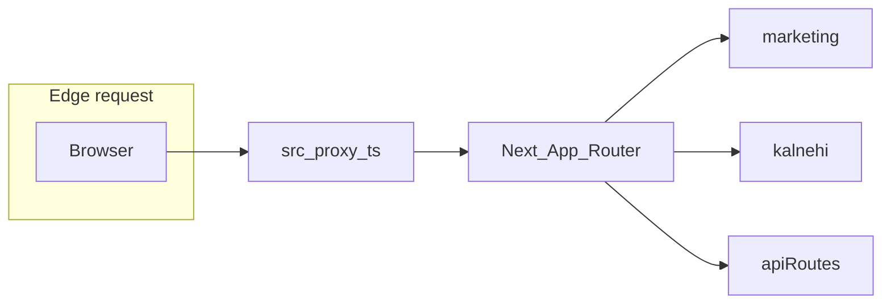

# Developer guide — Kalnehi Daily

Engineering onboarding: how requests move through the app, where auth and billing live, and how to operate cron and env safely. **Claims below map to source files** in this repo.

For device-specific QA (Capacitor, voice, push, billing UA), see [android-device-qa-matrix.md](./android-device-qa-matrix.md). For canonical URLs, sitemaps, and Google Search Console, see [SEO_ENVIRONMENT_GUIDE.md](../SEO_ENVIRONMENT_GUIDE.md), [GSC_DIAGNOSTICS_GUIDE.md](../GSC_DIAGNOSTICS_GUIDE.md), and [GSC_API_SETUP.md](../GSC_API_SETUP.md). For local development on the external SSD (volume layout, `npm ci`, Android SDK paths, sibling apps), see [EXTERNAL_SSD_DEV.md](./EXTERNAL_SSD_DEV.md).

---

## 1. Stack snapshot

- **Framework:** Next.js **16.2** App Router, React **19**, TypeScript (`package.json`).
- **Auth & DB:** Supabase (`@supabase/ssr` + `@supabase/supabase-js`).
- **Payments:** Razorpay (server keys + webhook).
- **Push:** Firebase Cloud Messaging (web + admin).
- **AI:** Groq, DeepInfra, optional Google Generative AI (see [.env.example](../.env.example)).

Route code lives under [`src/app/`](../src/app/): route groups **`(marketing)`** (public SEO pages), **`(kalnehi)`** (signed-in product surfaces), **`(landing)`**, plus top-level **`admin/`**, **`auth/`**, **`api/`**.

---

## 2. Request path: `src/proxy.ts` (Next.js 16)

Next.js 16 runs [`src/proxy.ts`](../src/proxy.ts) as the request **proxy** (see dev server timings: `proxy.ts`). There is no root `middleware.ts`.

**Order of work** (same file):

1. **Per-IP rate limits** — `RATE_LIMITS` for waitlist, annual/six-month plan, and `/api/admin/config` paths (`applyRateLimit`).
2. **Android shell billing block** — If `User-Agent` contains [`ANDROID_APP_UA_MARKER`](../src/lib/androidAppUa.ts) and the path is a billing/checkout route (`isAndroidAppBillingBlockedPath`), **307 redirect** to `/home`.
3. **Supabase session on the edge** — `createServerClient` with request cookies; **`getUser()`** refreshes the session.
4. **Auth gate** — If there is no user and the path is not **`isProxyAuthExempt`**, redirect to `/auth` while preserving refreshed cookies.
5. **B2B org sync** — On first sight of a user, resolve their `organization_id` and write it to the JWT (`syncOrgMembership`).

**Public marketing URLs** (anonymous HTML allowed) are defined in [`src/lib/public-paths.ts`](../src/lib/public-paths.ts) (`isPublicMarketingPath`). Exempt logic for the proxy must stay consistent with [`AppShell`](../src/components/AppShell.tsx) and paid-access rules.

**TTFB note:** The file header documents that **`getUser()`** runs before HTML on matched routes; use Network → Timing to diagnose (lines 13–17).

---

## 3. App config (daily trial cap)

The `app_config` table holds the daily trial cap settings, read via [`fetchAppConfig()`](../src/lib/admin/killSwitch.ts) (cached 30s, tag `app-config`). Managed from the admin System page ([`/admin/system`](../src/app/admin/system/page.tsx)).

> The former Edge Config kill switch and feature-flag systems were removed. `app_config` is retained only for the daily trial cap.

---

## 4. Auth and session

- **Browser:** [`getSupabaseBrowserClient()`](../src/lib/supabase.ts) **must** use `@supabase/ssr` so the session is **cookie-backed**; a plain client on `localStorage` will not match server actions (comment at lines 20–24). [`AuthProvider`](../src/components/AuthProvider.tsx) subscribes to auth state and can [`migrateLegacyLocalStorageSession`](../src/lib/supabase.ts).
- **Server Components / actions:** [`createSupabaseServerClient()`](../src/lib/supabase/server.ts) reads/writes cookies via `next/headers`.
- **OAuth return:** [`src/app/auth/callback/route.ts`](../src/app/auth/callback/route.ts) exchanges the code for a session.

**Pitfall:** `"Unauthorized"` in server actions often means the browser client was not `@supabase/ssr` or cookies were not refreshed—see `supabase.ts` comments.

Configure Supabase Auth redirect URLs as described in [.env.example](../.env.example) (site URL + `/auth/callback`).

---

## 5. App shell, trial, and paywall

[`AppShell`](../src/components/AppShell.tsx) (client) coordinates loading, **trial start** (`ensureFreeTrialStarted`, `TrialGuard`), and subscription UI (`SubscriptionPaywallInterstitial`, `useSubscriptionAccess`). Paths that skip the paid-access overlay must align with [`isPaidAccessOverlayExemptPath`](../src/lib/paid-access-exempt-paths.ts) and public marketing paths.

**Free trial constants** ([`src/lib/freeTrial.ts`](../src/lib/freeTrial.ts)):

- `FREE_TRIAL_DAYS = 7` (calendar-day window from `trial_started_at`).
- Welcome trial voice cap: `FREE_TRIAL_VOICE_CAP_SECONDS` (5 minutes); must stay aligned with DB RPCs.

**Database alignment:** Migration [`supabase/migrations/20260709120000_trial_welcome_window_7_days.sql`](../supabase/migrations/20260709120000_trial_welcome_window_7_days.sql) sets `admin_config.trial_duration_days` to `7` and defines **`consume_welcome_trial_voice_seconds`** (7-day window, 300 s cap, rejects when paid path applies).

---

## 6. Billing (Razorpay)

- **Env and events:** [.env.example](../.env.example) lists `RAZORPAY_*` and required webhook events.
- **Webhook:** [`src/app/api/razorpay/webhook/route.ts`](../src/app/api/razorpay/webhook/route.ts) (server verifies signature with `RAZORPAY_WEBHOOK_SECRET`).
- **Verification:** `npm run verify:razorpay-pricing`, `verify:razorpay-sub`, `verify:autopay-pricing` (`package.json`).

Keep **test vs live** keys and plan IDs consistent per `.env.example` notes.

---

## 7. Push notifications and Vercel cron

**Cron schedules** are declared in [`vercel.json`](../vercel.json), including:

- `/api/cron/system-push?phase=morning&ist=0700` and `evening&ist=2000`
- `/api/cron/custom-reminders`, `scheduled-notifications`, `sweep-prepbrain-ai-token-reservations`, `open-batches`, `notification-sequences`, `activate-trial-queue`, `refresh-leaderboard-snapshots`

**Auth:** Cron handlers use [`verifyCronSecret`](../src/lib/verifyCronSecret.ts) (see e.g. [`activate-trial-queue/route.ts`](../src/app/api/cron/activate-trial-queue/route.ts) lines 27–31; [`system-push/route.ts`](../src/app/api/cron/system-push/route.ts) imports the same helper). Set **`CRON_SECRET`** in Vercel; schedule **GET**s must send `Authorization: Bearer <CRON_SECRET>` as documented in each route’s comment block.

**FCM:** Public and server env vars are listed under Firebase in [.env.example](../.env.example). Use `npm run verify:fcm` where applicable.

---

## 8. AI and Mastermind (PrepBrain)

- **Chat API:** [`src/app/api/prepbrain/chat/route.ts`](../src/app/api/prepbrain/chat/route.ts) — uses Supabase server + service role where needed, trial/subscription checks (`isFreeTrialWindowActive`, `isPaidSubscriptionAccess` from [`freeTrial.ts`](../src/lib/freeTrial.ts)), tiered models (`mastermindModelsForTier`, `computeMastermindTier`, etc.).
- **Keys / models:** [.env.example](../.env.example) documents `GROQ_API_KEY`, `DEEPINFRA_API_KEY`, optional `GOOGLE_GENERATIVE_AI_API_KEY`, and Mastermind-related notes.
- **Tests:** `npm run test:prepbrain` — [`prepbrainIntentRouting.test.ts`](../src/lib/prepbrainIntentRouting.test.ts), [`mastermindModelTier.test.ts`](../src/lib/mastermindModelTier.test.ts).

---

## 9. Admin area

[`src/app/admin/layout.tsx`](../src/app/admin/layout.tsx) requires a logged-in user and **`isAdminUser`** from [`batchEngine`](../src/lib/waitlist/batchEngine.ts); otherwise redirects to `/auth` or `/home` (lines 9–20).

---

## 10. Security headers (CSP)

[`next.config.ts`](../next.config.ts) sets **Content-Security-Policy** (and report-only) plus `Referrer-Policy`, `Permissions-Policy`, etc. Third-party domains (Supabase, Firebase, Razorpay, analytics) are explicitly allowed—tighten only with care.

---

## 11. Canonical host and SEO

- **Redirect:** [`next.config.ts`](../next.config.ts) **`redirects()`** sends **`kalnehi.com` → `https://www.kalnehi.com`** (apex → www, permanent).
- **URLs in app:** [`getSiteUrl()`](../src/lib/site.ts), [`getSitemapBaseUrl()`](../src/lib/site.ts), [`absoluteSitemapUrl`](../src/lib/site.ts). Production should set **`NEXT_PUBLIC_SITE_URL=https://www.kalnehi.com`** per `site.ts` header.

Sitemap entries for **marketing** paths are built from [`MARKETING_SITEMAP`](../src/lib/sitemap-data.ts) (not app-only routes); see [SEO_ENVIRONMENT_GUIDE.md](../SEO_ENVIRONMENT_GUIDE.md).

---

## 12. Troubleshooting (quick)

| Symptom | Likely cause | Where to look |
| -------- | ------------- | ------------- |
| `Unauthorized` in server actions | Cookie session not shared; wrong client | [`src/lib/supabase.ts`](../src/lib/supabase.ts), [`AuthProvider`](../src/components/AuthProvider.tsx) |
| 401 on cron URLs | Missing/mismatched `CRON_SECRET` | Route file + [`verifyCronSecret`](../src/lib/verifyCronSecret.ts) |
| Razorpay/webhook oddities | Test vs live mismatch | [.env.example](../.env.example), webhook route |
| Play billing URLs redirect | Android UA marker | [`proxy.ts`](../src/proxy.ts) `isAndroidAppBillingBlockedPath`, [android-device-qa-matrix.md](./android-device-qa-matrix.md) |
| Trial voice errors | Trial not started, window ended, or cap | RPC in migration above; [`freeTrial.ts`](../src/lib/freeTrial.ts) |

---

## 13. Related scripts

See [README.md](../README.md) for the full **`npm run`** table (lint, build, verify:* , tests).
